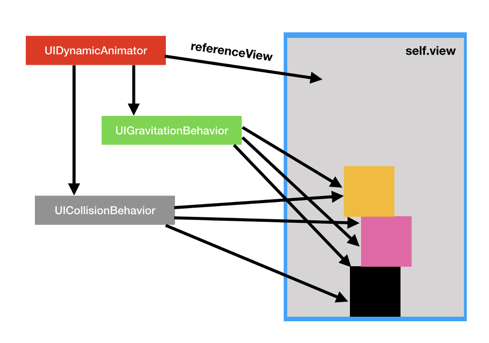

build-lists: true 
autoscale: true

# [fit]UIKit 
# [fit]Dynamics
---

## [fit]What is it?

* Simple, convenience API for animating views with physics.
* Views can get gravity, collisions, bouncing, and momentary forces.
* Not a gaming engine.
* It's a way to create 2D animations of position and rotation transforms.
* UIKit Dynamics is for creating momentary emphasis in your interface.

---

## [fit]3 Parts to UIKit Dynamics

1. `UIDynamicAnimator` 

2. `UIDynamicBehavior` 

3. `UIDynamicItem` 

---

## [fit]1. UIDynamicAnimator

`init(referenceView view: UIView)`

- Has a reference view that is the "stage" or "context".
- Views you want to animate must be children of the reference view.
- You must retain the instance of `UIDynamicAnimator`.
`UIDynamicAnimator` also holds `UIDynamicBehavior` instances.

---

## [fit]More...

`UIDynamicBehavior` holds the items (Usually UIView instances) that will have the animations applied to them.
Items are `UIDynamicItem` protocol implementers.
• Add or remove behaviours: `addBehavior(_:)` remove `removeBehavior(_:)`, `removeAllBehaviors()`
-  UIDynamicAnimator handles a delegate with a few methods around pausing and resuming.
-  Animators can be created empty.
-  Can also be initialized with a UICollectionViewLayout.

---

## [fit]2. UIDynamicBehavior
-  UIDynamicBehavior is a rule describing how a view should behave.
- Most often you will use the subtypes  UIGravityBehavior or UICollisionBehavior.
• Other subtypes: UIAttachmentBehavior, UIDynamicItemBehavior, UIPushBehavior, and UISnapBehavior
- Simply configure the behavior with items (UIDynamicItem) and add them to the animator instance.
- You can change a behaviours configuration even while in flight

---

## [fit]3. Items

- Items have behaviours applied to them.
-  Any object that implements `UIDynamicItem` protocol can be an item.
• `UIView` and `UICollectionViewLayoutAttribute` conform out of the box.
You add `UIDynamicItem` instances to the `UIDynamicItemBehavior` class using init or by setting its properties.

On `UIDynamicItemBehavior`:
`func addItem(_ item: UIDynamicItem)`
`init(items: [UIDynamicItem])`

---
